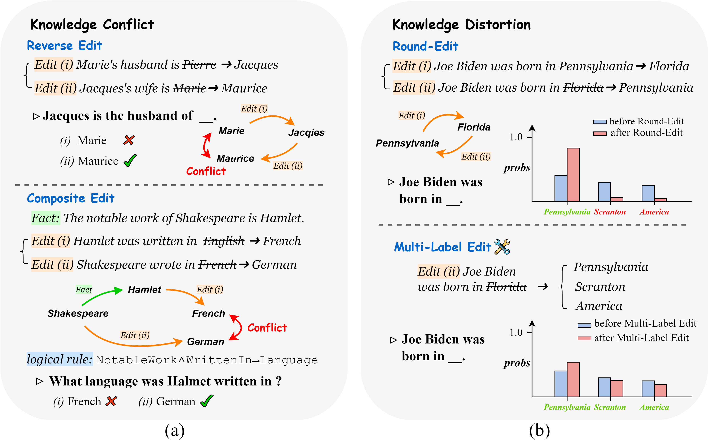
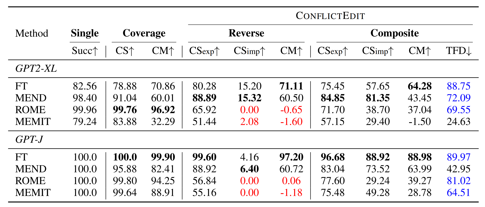
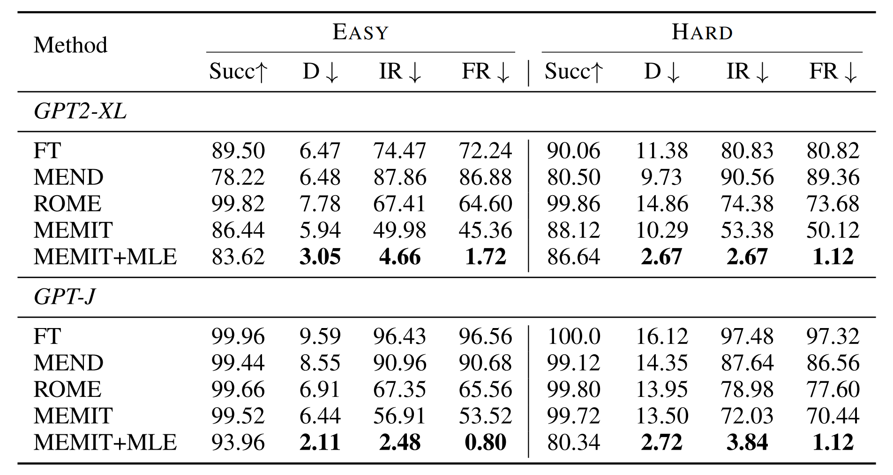

<h1 align='center'>Pitfalls of Editing LLMs</h1>

Code for the ICLR2024 paper: "[Unveiling the Pitfalls of Knowledge Editing for Large Language Models](https://arxiv.org/abs/2310.02129)".


---

<div align=center></div>

[Knowledge Editing](https://github.com/zjunlp/KnowledgeEditingPapers) provides an efficient way to change the behavior of LLMs without resorting to an exhaustive retraining or continuous training procedure. As the number of edits increases, the model might manifest **Knowledge Conflict** when dealing with inputs involved with multiple consecutive edits. Meanwhile, each edit could potentially lead to ruptures in knowledge links within the model, resulting in **Knowledge Distortion**.

---



**Overview:** (a) Through **Reverse Edit** and **Composite Edit**, we can observe that previous knowledge editing approaches may trigger Knowledge Conflict, leading to failures of knowledge editing; (b) Through **Round-Edit**, we notice that previous knowledge editing approaches may lead to Knowledge Distortion, and the underlying knowledge structure within LLMs can be disrupted.

## Table of Contents

- [Installation](#installation)
- [Dataset Format](#dataset-format)
- [Evaluation](#evaluation)
- [Summerization](#summerization)
- [Experimental Results](#experimental-results)
- [How to Cite](#how-to-cite)
- [Acknowledgements](#acknowledgements)

## Installation

Please use Python 3.9+ to get started, install `conda` and run:
```bash
conda create -n EditLLMs python=3.9.7
pip install -r requirements.txt
```

**Note:** We recommend `conda` for managing Python, CUDA, and PyTorch=1.12.1.

## Dataset Format

### ConflictEdit

Each dataset split in this part contains 2500 data, except 2000 data in `./data/GPT2-XL/composite_edit.json`. Take `reverse_edit.json` for example:

```json
{
    "rule": "Logical Rule", 
    "triples": [
        {
            "relation": {
                "id": "ID in WikiData",
                "prompt": "Prompt of Relation",
                "query": "Prompt of Relation in the query format",
                "label": "Relation Description"
            },
            "subject": {
                "id": "ID in WikiData",
                "label": "Entity Description"
            },
            "object": {
                "id": "ID in WikiData",
                "label": "Entity Description"
            }
        },                  // Triple 1
        "... Triple 2"
    ],
    "prerequisites": [],    // Tied Fact Dependency
    "type": "reverse",      // Edit Type
    "edits": [
        {
            "relation": "Same as above",
            "subject": "Same as above",
            "object": "Object to be edit",
            "new_object": "Target Object of editing"
        },                  // Edit 1
        "... Edit 2"
    ]
}
```

### RoundEdit

Each dataset split in this part contains 2500 data.Take `easy.json` for example:

```json
{
    "type": "1-N@RelationID",   // N means 1-n relation
    "edit": {
        "relation": "Same as above",
        "subject": "Same as above",
        "new_object": "Intermediate object in Round-Edit",
        "object": "Target object in Round-Edit"
    },
    "true_objects": [
        {
            "id": "ID in WikiData",
            "label": "Entity Description"
        },                      // True object 1
        "... True objects"
    ]
}
```

## Evaluation

### Knowledge Conflict

To evaluate Knowledge Conflict, simply utilize the scripts as:

```shell
bash run_conflictedit.sh
```

The dataset split can be changed by modified the `mode` in [`run_conflictedit.sh`](scripts/run_conflictedit.sh) and also the model type, hyperparameters and editing methods. The experimental results are written in `./{ModelName}/conflict_results/`

### Knowledge Distortion

To evaluate Knowledge Conflict, please follow the **Steps** as:

- **Step 1:** Obtain the results on the original model by running:

```shell
bash run_model.sh
```

- **Step 2:** Obtain the main results as:

```shell
bash run_roundedit.sh
```

- **Step 3:** Obtain the **Multi-Label Edit (MLE)** results as:

```shell
bash run_MLE.sh
```

The dataset split can be changed by modified the `mode` in each script and also the model type, hyperparameters and editing methods. The experimental results are written in `./{ModelName}/round_results/`


**Note:** We train MEND on our datasets and the checkpoints are available in [Google Drive](https://drive.google.com/drive/folders/1D9kQDY6DkBAJPM85nv1ancwqmaBvVkvY?usp=sharing).

## Summerization

To summarize the results, you can use [`experiments/summarize.py`](experiments/summarize.py):

```bash
python3 -m experiments.summarize --res_dir=GPT-J
```

## Experimental Results

### Knowledge Conflict



### Knowledge Distortion

<div align=center></div>

## How to Cite

```bibtex
@article{li2023unveiling,
  title={Unveiling the pitfalls of knowledge editing for large language models},
  author={Li, Zhoubo and Zhang, Ningyu and Yao, Yunzhi and Wang, Mengru and Chen, Xi and Chen, Huajun},
  journal={arXiv preprint arXiv:2310.02129},
  year={2023}
}
```

## Acknowledgements

We appreciate [OpenAI GPT4 Service](https://openai.com/gpt-4), [MEMIT](https://github.com/kmeng01/memit), [EasyEdit](https://github.com/zjunlp/EasyEdit) and many other related works for their open-source contributions.
